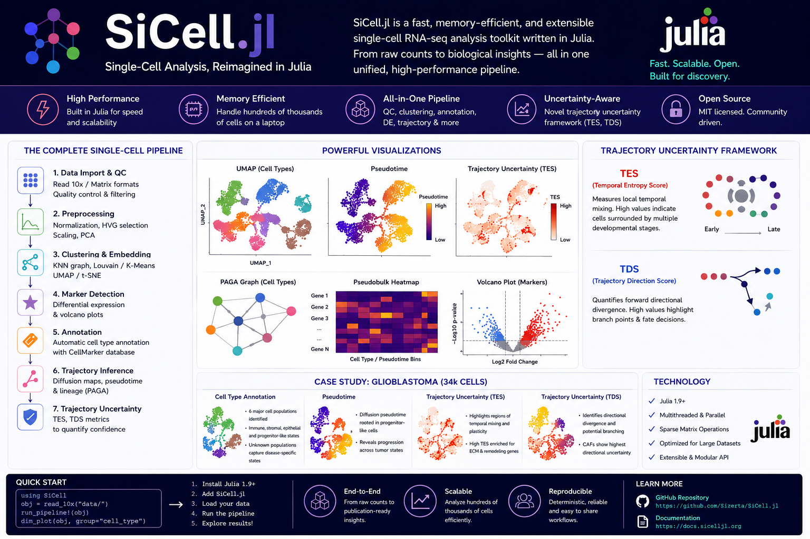

# SiCell.jl — High-Performance Single-Cell RNA-seq Analysis in Native Julia


[](https://github.com/Sizerta/SiCell.jl/actions/workflows/CI.yml)
[](https://sizerta.github.io/SiCell.jl)
[](https://juliahub.com/ui/Packages/General/SiCell)
[](https://juliahub.com/ui/Packages/General/SiCell)
[](https://opensource.org/licenses/MIT)


SiCell.jl is a modern, Julia-native toolkit for single-cell RNA sequencing (scRNA-seq) analysis. It provides a complete end-to-end workflow from raw count matrices to biological interpretation, combining high performance, scalable sparse computations, and an intuitive API.

---

# 🚀 Key Features

## 🔬 Complete Single-Cell Analysis Pipeline

* 📂 Data loading:

  * 10x Genomics matrices
  * Hierarchical Data Format(`.h5`)
  * AnnData (`.h5ad`) files

* 🧪 Quality control:

  * Cell filtering
  * Mitochondrial content analysis
  * Gene and count statistics

* ⚖️ Preprocessing:

  * Library-size normalization
  * Log transformation
  * Highly variable gene selection
  * Feature scaling

* 📊 Dimensionality reduction:

  * Randomized PCA
  * UMAP
  * Diffusion Maps

* 🧩 Clustering:

  * Graph-based clustering
  * K-Means clustering
  * Efficient KNN graph construction

* 🧬 Differential expression:

  * Sparse-aware Wilcoxon rank-sum testing
  * Multiple-testing correction

* 🏷️ Cell type annotation:

  * Marker-based annotation using CellMarker and PangaloDb as references

* 🌱 Trajectory analysis:

  * Diffusion pseudotime
  * **Trajectory Uncertainty Framework (TUF)**:

    * TES (Temporal Entropy Score) — local temporal heterogeneity
    * TDS (Trajectory Divergence Score) — directional uncertainty and branching

* 🎨 Publication-quality visualization:

  * UMAP embeddings
  * Feature plots
  * Violin plots
  * Heatmaps
  * Volcano plots
  * PAGA-style connectivity graphs
  * Trajectory uncertainty maps

---

# ⚡ Performance

SiCell is designed around efficient sparse matrix operations, multithreading, and memory-aware algorithms.

### Performance highlights

* Native Julia implementation
* Sparse-aware algorithms
* Multi-threaded computations
* Randomized SVD-based PCA for large datasets
* Efficient graph construction and downstream analysis

Benchmarks are currently being expanded on datasets ranging from PBMCs to large-scale tumor atlases.

---

# 📦 Installation

```julia
using Pkg
Pkg.add("SiCell")

```

---

# ⚡ Quick Start

```julia
using SiCell

# Load data
obj = read_10x("path/to/filtered_feature_bc_matrix")

# Quality control
calculate_qc_metrics!(obj)
filter_cells!(
    obj;
    min_genes=200,
    max_mito=5.0
)

# Preprocessing
normalize_data!(obj)
find_variable_features!(obj)

# Dimensionality reduction
run_pca!(obj)

# Graph construction and clustering
find_neighbors!(obj, k=20)
run_graph_clustering!(obj)

# Visualization
run_umap!(obj)

dim_plot(
    obj,
    reduction="umap",
    group="graph_cluster"
)
```

---

# 🌱 Example Applications

SiCell has been tested on multiple biological systems, including:

* Human PBMC datasets
* Large-scale tumor microenvironment datasets

  * Breast cancer (>34,000 cells)
  * Glioblastoma datasets

Example analyses include:

* Automated cell-type annotation
* Marker discovery
* Differential expression
* Trajectory reconstruction
* Identification of uncertain transition states using TUF

---

# 📚 Documentation

Documentation includes:

* Getting started tutorials
* Complete analysis workflows
* Case studies
* Visualization examples
* API reference

---

# 📄 Citation

A manuscript describing SiCell.jl and the Trajectory Uncertainty Framework (TUF) is currently in preparation.

If you use SiCell in your research before publication, please cite the GitHub repository.

Repository:

https://github.com/Sizerta/SiCell.jl

---

# 🤝 Contributing

Bug reports, feature requests, and pull requests are welcome.

---

# 📜 License

SiCell.jl is released under the MIT License.
