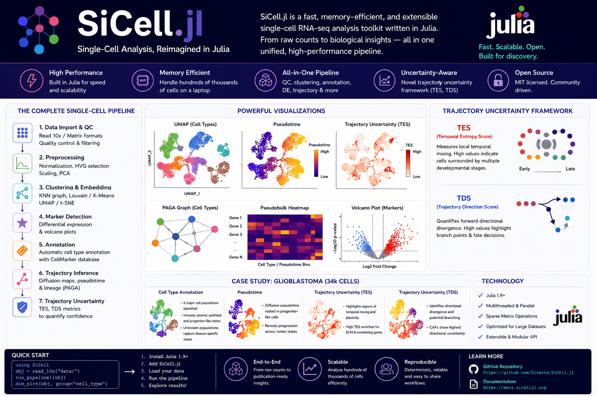

# SiCell.jl — High-Performance Single-Cell RNA-seq Analysis in Native Julia


[](https://github.com/Sizerta/SiCell.jl/actions/workflows/CI.yml)
[](https://sizerta.github.io/SiCell.jl)
[](https://juliahub.com/ui/Packages/General/SiCell)
[](https://juliahub.com/ui/Packages/General/SiCell)
[](https://opensource.org/licenses/MIT)


SiCell.jl is a modern, Julia-native toolkit for single-cell RNA sequencing (scRNA-seq) analysis. It provides a complete end-to-end workflow from raw count matrices to biological interpretation, combining high performance, scalable sparse computations, and an intuitive API.

---


#  Installation

```julia
using Pkg
Pkg.add("SiCell")

```

---

# ⚡ Quick Start

```julia
using SiCell

# Load data
obj = read_10x("path/to/filtered_feature_bc_matrix")

# Quality control
calculate_qc_metrics!(obj)
filter_cells!(
    obj;
    min_genes=200,
    max_mito=5.0
)

# Preprocessing
normalize_data!(obj)
find_variable_features!(obj)

# Dimensionality reduction
run_pca!(obj)

# Graph construction and clustering
find_neighbors!(obj, k=20)
run_graph_clustering!(obj)

# Visualization
run_umap!(obj)

dim_plot(
    obj,
    reduction="umap",
    group="graph_cluster"
)
```

---


#  Documentation
Please look at the site below:

https://sizerta.github.io/SiCell.jl/

Documentation includes:

* Getting started tutorials
* Complete analysis workflows
* Example Applications
* Case studies
* Visualization examples
* API reference
---
#  Example Applications

SiCell has been tested on multiple biological systems, including:

* Human PBMC datasets
* Large-scale tumor microenvironment datasets
  * Breast cancer (>34,000 cells)
  * Glioblastoma datasets

Example analyses include:

* Automated cell-type annotation
* Marker discovery
* Differential expression
* Trajectory reconstruction
* Identification of uncertain transition states using TUF


---
## Related Software

Interested in quantifying uncertainty in trajectory inference?

**TUF (Trajectory Uncertainty Framework)** is a standalone Python package that introduces two complementary uncertainty metrics for single-cell trajectory analysis:

- **Temporal Entropy Score (TES)** — measures local temporal mixing.
- **Trajectory Divergence Score (TDS)** — quantifies directional ambiguity near branching regions.

TUF is designed for the Scanpy ecosystem and can be used alongside any pseudotime inference method that stores results in an `AnnData` object.

**Repository:** https://github.com/Sizerta/tuf_python

---
# 🚀 Key Features

##  Complete Single-Cell Analysis Pipeline

- Data loading:
  - 10x Genomics matrices
  - Hierarchical Data Format(`.h5`)
  - AnnData (`.h5ad`) files

- Quality control:
  - Cell filtering
  - Mitochondrial content analysis
  - Gene and count statistics

- Preprocessing:
  - Library-size normalization
  - Log transformation
  - Highly variable gene selection
  - Feature scaling

- Dimensionality reduction:
  - Randomized PCA
  - UMAP
  - Diffusion Maps

- Clustering:
  - Graph-based clustering
  - K-Means clustering
  - Efficient KNN graph construction

- Differential expression:
  - Sparse-aware Wilcoxon rank-sum testing
  - Multiple-testing correction

- Cell type annotation:
  - Marker-based annotation using CellMarker and PanglaoDB as references

- Trajectory analysis:
  - Diffusion pseudotime
  - **Trajectory Uncertainty Framework (TUF)**:
    - TES (Temporal Entropy Score) — local temporal heterogeneity
    - TDS (Trajectory Divergence Score) — directional uncertainty and branching

- Publication-quality visualization:
  - UMAP embeddings
  - Feature plots
  - Violin plots
  - Heatmaps
  - Volcano plots
  - PAGA-style connectivity graphs
  - Trajectory uncertainty maps

---

# ⚡ Performance

SiCell is designed around efficient sparse matrix operations, multithreading, and memory-aware algorithms.

### Performance highlights

* Native Julia implementation
* Sparse-aware algorithms
* Multi-threaded computations
* Randomized SVD-based PCA for large datasets
* Efficient graph construction and downstream analysis

Benchmarks are currently being expanded on datasets ranging from PBMCs to large-scale tumor atlases.

---
#  Citation

If you use SiCell.jl in your research, please cite the software. Citation metadata is provided in [`CITATION.cff`](CITATION.cff) (GitHub's "Cite this repository" button generates BibTeX/APA from it):

> Mahdavifar M. *SiCell.jl: A High-Performance, Native Julia Framework for End-to-End Single-Cell RNA-Sequencing Analysis* (Version 0.1.1) [Computer software]. https://github.com/Sizerta/SiCell.jl

If you use the Trajectory Uncertainty Framework (TES/TDS) in SiCell, please also cite the TUF preprint:

> Mahdavifar M, Mohammadifar Z, Iranpourtari T. Trajectory Uncertainty Framework (TUF): A Modular Framework for Identifying Transitional and Branch-Point Cell States in Single-Cell Trajectory Analysis. *bioRxiv* (2026). https://doi.org/10.64898/2026.07.31.742012

---

#  Contributing

Bug reports, feature requests, and pull requests are welcome. See [CONTRIBUTING.md](CONTRIBUTING.md) for guidelines.

---

# License

SiCell.jl is released under the MIT License.
