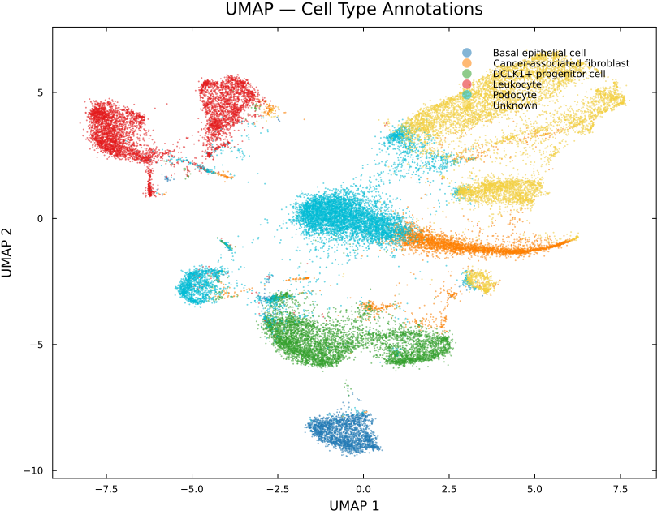
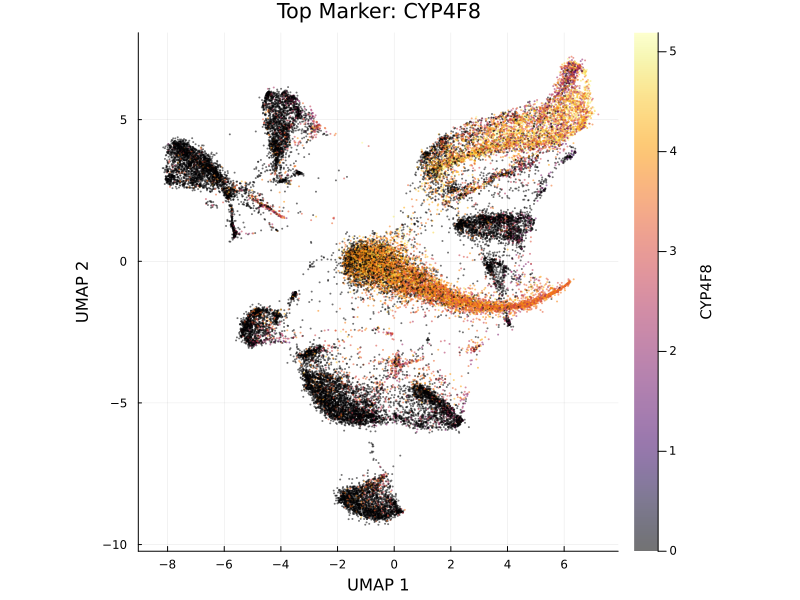
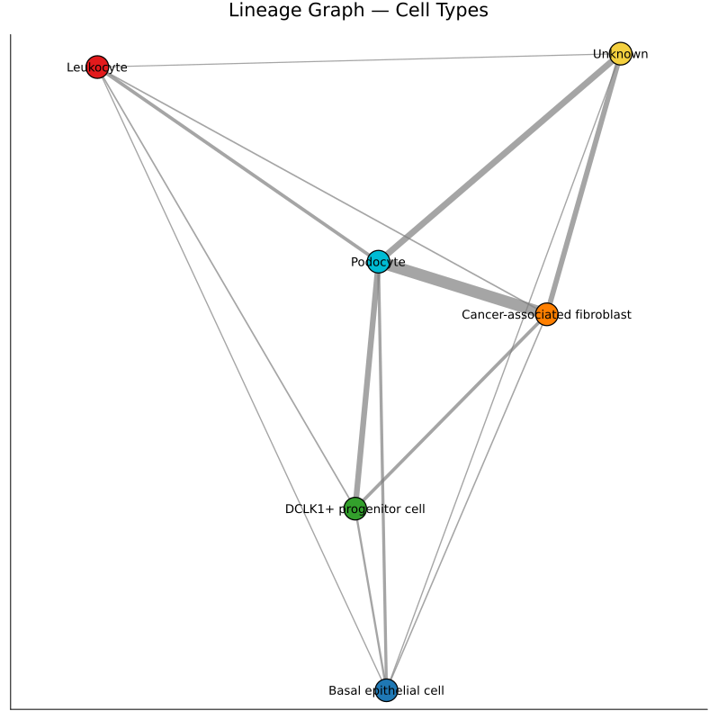
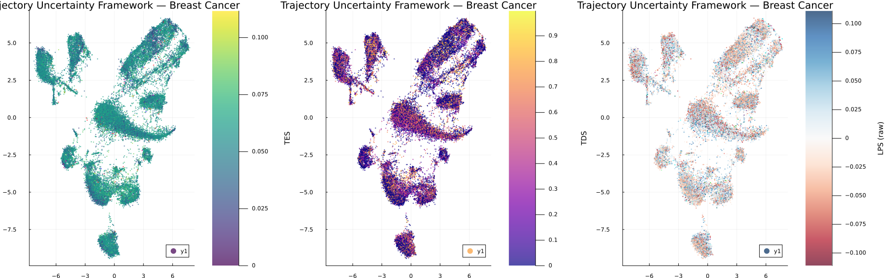
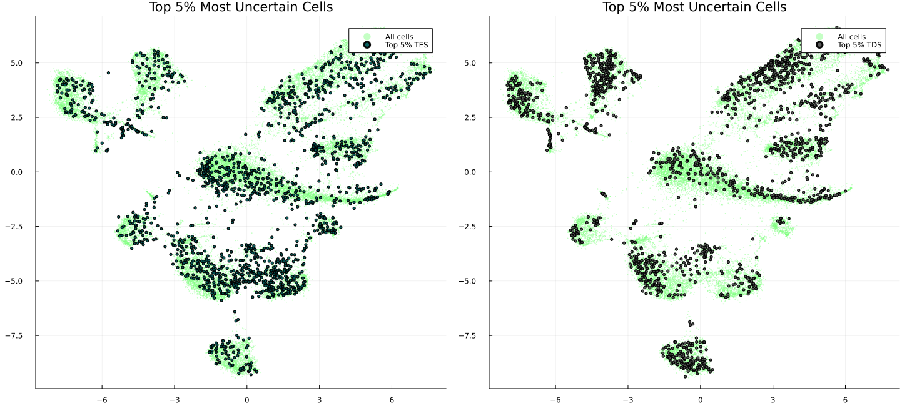

# Case Study: Breast Cancer Tumor Microenvironment Analysis with SiCell.jl

## Overview

This case study demonstrates the application of **SiCell.jl** to a large-scale breast cancer single-cell RNA sequencing dataset containing **34,144 cells**. The analysis covers the complete workflow from preprocessing and cell type annotation to trajectory inference and the **Trajectory Uncertainty Framework (TUF)**.

The goal is to identify cellular populations within the tumor microenvironment, reconstruct potential developmental transitions, and quantify regions of cellular plasticity and lineage ambiguity using **Temporal Entropy Score (TES)**, **Trajectory Divergence Score (TDS)**, and **Local Progression Score ()**.

---

# 1. Cell Population Identification

After quality control, normalization, dimensionality reduction, and clustering, SiCell identified eight initial clusters.

Marker-based annotation using the CellMarker database revealed the following major cell populations:

| Cell Type | Number of Cells |
|---|---:|
| Podocyte | 8,486 |
| DCLK1+ progenitor cells | 5,660 |
| Leukocytes | 5,511 |
| Cancer-associated fibroblasts | 3,916 |
| Basal epithelial cells | 2,319 |
| Unknown populations | 8,252 |

The presence of multiple **Unknown** populations highlights the complexity of the tumor microenvironment and may represent poorly characterized, transitional, or disease-specific cell states.

---

## UMAP Visualization of Annotated Cell Types

*UMAP embedding colored by CellMarker-based cell type annotations. Distinct immune, stromal, epithelial, and progenitor-like populations can be observed across the tumor landscape.*

---

# 2. Marker Gene Characterization

Differential expression analysis identified cluster-specific marker genes that define the molecular identity of individual populations.

Representative markers included:

- **CYP4F8**
- **INHBA**
- **RGS16**
- **ADGRD2**
- **OVCH2**
- **IRX4**
- **HPN**
- **LRRC31**
- **PODXL**
- **PTPRC**

These genes provide molecular signatures distinguishing tumor-associated fibroblasts, immune populations, epithelial states, and other specialized cellular compartments.

---

## Feature Expression Example

*Feature plot showing the expression pattern of the marker gene **CYP4F8** across the breast cancer cellular landscape.*

---

# 3. Connectivity Analysis of the Tumor Microenvironment

SiCell generated a PAGA-style connectivity graph to summarize relationships between major cell populations.

Strong connectivity was observed between several stromal and progenitor-associated populations, including:

- Cancer-associated fibroblasts ↔ Podocytes
- Podocytes ↔ DCLK1+ progenitor cells
- Podocytes ↔ Unknown populations

These connections suggest potential transcriptional similarity or shared transitional states between different cellular compartments.

---

## Cell Population Connectivity Graph

*Population-level connectivity graph showing transcriptional relationships between annotated cell types.*

---

# 4. Diffusion-Based Trajectory Inference

To investigate continuous cellular transitions, a diffusion map was constructed using the nearest-neighbor graph.

A **DCLK1+ progenitor population** was selected as the trajectory root due to its stem-like characteristics.

Diffusion pseudotime ordering revealed how cells transition away from this progenitor-like state toward more differentiated transcriptional programs.

---

# 5. Trajectory Uncertainty Framework (TUF)

Traditional pseudotime methods assign a trajectory position to each cell but do not quantify whether the local trajectory is stable or ambiguous.

SiCell's TUF addresses this using three complementary metrics:

- **TES (Temporal Entropy Score)**  
  Measures local temporal mixing between neighboring cells.

- **TDS (Trajectory Divergence Score)**  
  Measures disagreement between forward developmental directions and identifies potential branching regions.

---

## Global Trajectory Uncertainty

Across 34,144 cells:

| Metric | Mean | Maximum |
|---|---:|---:|
| TES | 0.054 | 0.112 |
| TDS | 0.247 | 0.997 |

The high maximum TDS value suggests the presence of strongly divergent regions within the tumor trajectory landscape.

---

## TUF Visualization

*Visualization of TES, TDS across the cellular manifold. High uncertainty regions may correspond to cell-state transitions, branching trajectories, or plastic tumor populations.*

---

# 6. Cell-Type Level Trajectory Uncertainty

Average uncertainty scores revealed differences in cellular plasticity between populations.

| Cell Type | Mean TES | Mean TDS |
|---|---:|---:|
| DCLK1+ progenitor | 0.055 | 0.238 |
| Podocyte | 0.055 | 0.241 |
| Cancer-associated fibroblast | 0.054 | **0.293** |
| Basal epithelial | 0.054 | 0.253 |
| Unknown | 0.053 | 0.215 |
| Leukocyte | 0.052 | 0.278 |

Notably, **cancer-associated fibroblasts exhibited the highest average TDS**, indicating greater directional heterogeneity and potential involvement in dynamic remodeling of the tumor microenvironment.

---

# 7. Validation of High-Uncertainty Regions

Cells within the top 5% of TES scores were extracted and analyzed using differential expression.

The most enriched genes included:

| Gene | Biological Association |
|---|---|
| AEBP1 | Extracellular matrix remodeling |
| COL5A1 | Collagen organization |
| COL6A3 | Stromal activation |
| DCN | Fibroblast identity |
| CCN2 | Tissue remodeling and fibrosis |
| FN1 | Cell adhesion and migration |
| ELN | Extracellular matrix organization |

The enrichment of extracellular matrix and stromal remodeling genes supports the biological relevance of high-TES regions.

---

## High-Uncertainty Cell Localization

*Cells with the highest TES scores highlighted on the UMAP embedding. These regions may represent highly plastic cellular states and active tumor remodeling zones.*

---

# 8. Relationship Between TUF Metrics

Correlation analysis showed that the three uncertainty measures capture related but distinct biological properties.

| Comparison | Correlation |
|---|---:|
| TES ↔ TDS | 0.313 |
| TES ↔  | 0.262 |
| TDS ↔  | 0.763 |

The moderate TES–TDS correlation demonstrates that temporal mixing and directional divergence provide complementary information rather than measuring the same phenomenon.

---

# Biological Insights

This analysis demonstrates that SiCell can move beyond traditional clustering and pseudotime analysis by identifying regions of cellular instability and potential fate transitions.

Key observations include:

- **DCLK1+ progenitor cells display elevated trajectory uncertainty**, consistent with a more plastic and less committed cellular state.
- **Cancer-associated fibroblasts exhibit the strongest directional divergence**, suggesting dynamic remodeling behavior.
- High-TES cells are enriched for extracellular matrix and stromal activation genes such as **COL5A1**, **COL6A3**, **CCN2**, and **FN1**.
- TES, TDS  capture complementary aspects of tumor heterogeneity.

---

# Conclusion

Using a single integrated workflow, **SiCell.jl** transformed a 34,144-cell breast cancer dataset into interpretable biological insights.

The combination of clustering, automated annotation, trajectory inference, and the Trajectory Uncertainty Framework enables researchers to identify not only **where cells are along a trajectory**, but also **how confidently that trajectory can be interpreted**.

This provides a powerful framework for studying tumor plasticity, cellular transitions, and the dynamic organization of complex tissues.

---
**Complete analysis script:** `examples/case_study_breast_cancer.jl`
