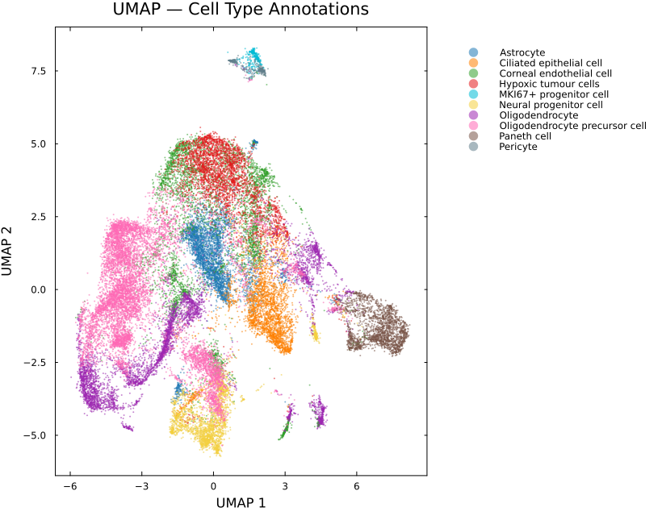
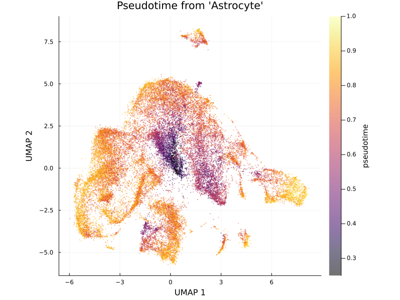
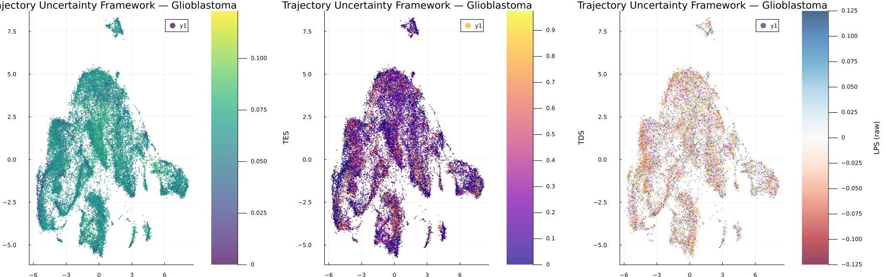

# Case Study: Revealing Hidden Cellular Plasticity in Glioblastoma with TUF

## Overview

Understanding cellular transitions within tumors is a major challenge in single-cell analysis. Traditional pseudotime methods assign cells along a developmental trajectory but do not indicate whether local trajectory structure is stable, transitional, or directionally ambiguous.

Using SiCell.jl, we analyzed a glioblastoma (GBM) single-cell RNA sequencing dataset and applied the **Trajectory Uncertainty Framework (TUF)** to quantify two complementary aspects of cellular uncertainty:

* **Temporal Entropy Score (TES):** local heterogeneity of neighboring cells along pseudotime.
* **Trajectory Divergence Score (TDS):** disagreement between potential forward developmental directions.

Together, these metrics reveal stable states, transitional populations, and regions of cellular plasticity that are not captured by pseudotime alone.

---

## 1. Standard Single-Cell Processing

The dataset was processed using the standard SiCell.jl workflow:

```julia
using SiCell

calculate_qc_metrics!(obj)
filter_cells!(obj)
normalize_data!(obj)

find_variable_features!(obj)
run_pca!(obj)

find_neighbors!(obj)
run_umap!(obj)

run_graph_clustering!(obj)
```

The resulting UMAP reveals the major transcriptional populations within the GBM microenvironment.



*Figure 1. UMAP embedding showing major cellular populations identified in the GBM dataset.*

---

## 2. Diffusion-Based Trajectory Analysis

To model continuous changes in cellular state, diffusion maps and graph-based pseudotime were computed:

```julia
run_diffusion_map!(obj)

run_pseudotime!(
    obj,
    root_cell,
    method="graph"
)
```

Pseudotime reconstructs the progression of cellular states but does not provide information about uncertainty.



*Figure 2. Diffusion pseudotime reveals the progression of cellular states across the GBM landscape.*

---

## 3. Quantifying Trajectory Uncertainty

TUF was applied directly on the pseudotime graph:

```julia
trajectory_uncertainty!(obj)
```

This produces two complementary measurements:

### Temporal Entropy Score (TES) and Trajectory Divergence Score (TDS)

TES identifies regions where neighboring cells occupy heterogeneous positions along the trajectory.

TDS measures disagreement in local forward developmental directions.

```julia
 trajectory_uncertainty_plot(obj, title="Trajectory Uncertainty Framework — Glioblastoma")
```



*Figure 3. TES highlights regions of elevated temporal heterogeneity, suggesting transitional or plastic cellular states. TDS identifies regions where cells have multiple potential future trajectory directions*

---


---

## 4. TES and TDS Capture Distinct Biological Signals

Although both metrics quantify trajectory uncertainty, they represent different biological phenomena.

* **High TES, low TDS:** heterogeneous populations occupying mixed developmental stages.
* **Low TES, high TDS:** branch points or competing developmental paths.
* **High TES and high TDS:** highly dynamic states with both temporal mixing and directional ambiguity.

This separation allows researchers to distinguish different forms of cellular plasticity that would otherwise appear similar using pseudotime alone.

---

## 5. Biological Interpretation of High-Uncertainty States

Cells with elevated TES were associated with stress-response and adaptive programs, including:

* Hypoxia
* TNF-α/NF-κB signaling
* Apoptosis
* Epithelial–mesenchymal transition (EMT)

These pathways suggest that high TES regions correspond to environmentally driven cellular adaptation rather than simple developmental progression.

TDS identified distinct biological processes associated with changes in trajectory directionality, indicating that temporal heterogeneity and lineage divergence represent separate dimensions of cellular state transitions.

---

## 6. Key Findings

This analysis demonstrates how TUF extends conventional trajectory analysis:

| Method     | Information Provided                                     |
| ---------- | -------------------------------------------------------- |
| Pseudotime | Ordering of cells along a trajectory                     |
| TES        | Temporal heterogeneity and cellular plasticity           |
| TDS        | Directional ambiguity and potential branching            |
| TES + TDS  | Comprehensive characterization of trajectory uncertainty |

By combining these complementary measurements, SiCell.jl enables researchers to move beyond trajectory reconstruction and identify biologically meaningful transition states.

---

## Reproducibility

The complete analysis workflow, including preprocessing, trajectory inference, uncertainty quantification, and visualization, can be reproduced using the SiCell.jl tutorials and API documentation.

**Complete analysis script:** `examples/case_study_glioblastoma.jl`