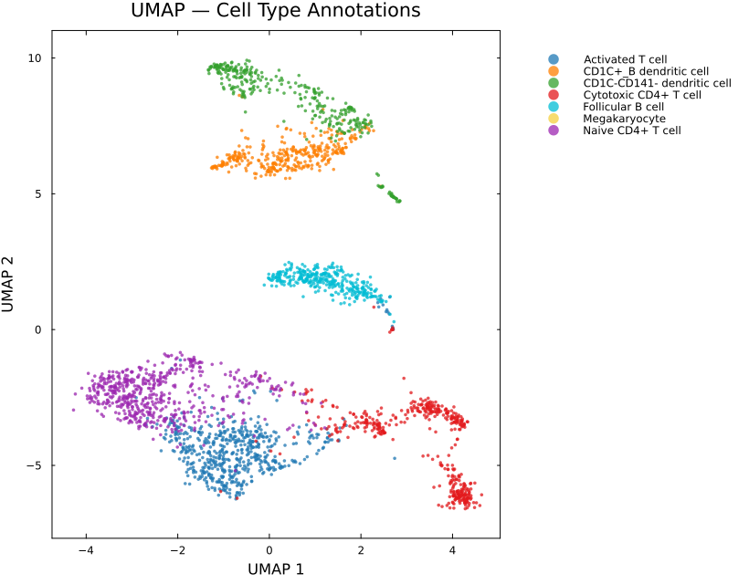
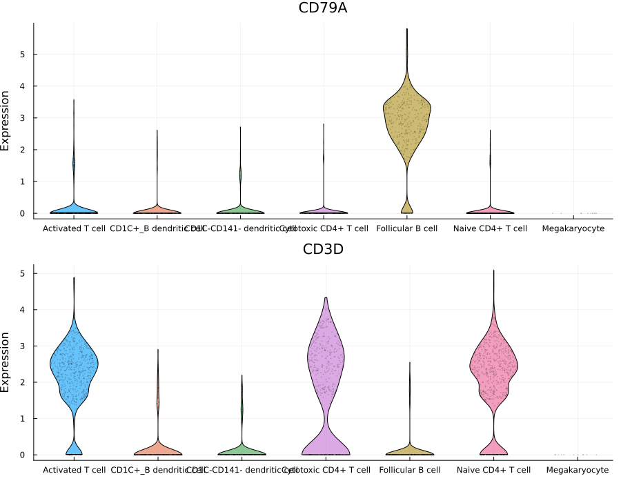
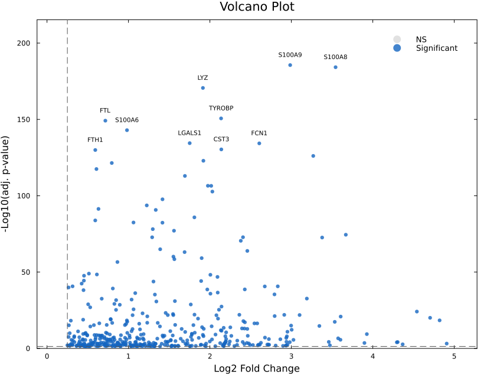
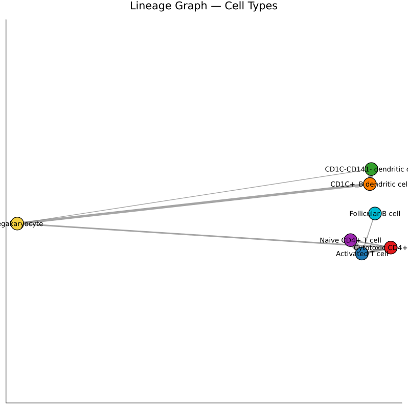
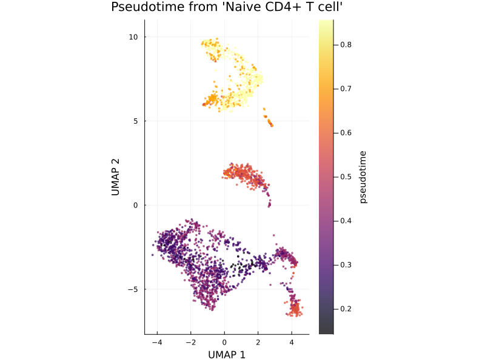
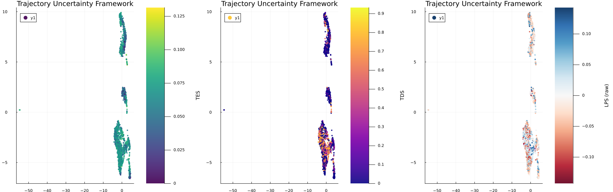

# PBMC 3k Case Study: End-to-End Single-Cell Analysis with SiCell.jl

## Overview

This case study demonstrates a complete single-cell RNA sequencing (scRNA-seq) analysis workflow using **SiCell.jl** on the widely used **10x Genomics PBMC 3k dataset**.

Starting from raw count matrices, we perform:

* Quality control and preprocessing
* Dimensionality reduction
* Graph-based clustering
* Automated cell type annotation
* Marker gene analysis
* Differential expression visualization
* Diffusion-based trajectory inference
* Trajectory Uncertainty Framework (TES, TDS)

This example highlights how SiCell.jl provides an integrated workflow from raw sequencing data to biologically meaningful insights.

---

# 1. Data Loading and Quality Control

The PBMC 3k dataset contains approximately 3,000 human peripheral blood mononuclear cells.

After quality filtering, **2,643 high-quality cells** were retained for downstream analysis.

```julia
obj = read_10x(DATA_PATH)

calculate_qc_metrics!(obj)

filter_cells!(
    obj,
    min_genes=200,
    max_mito=5.0
)
```

---

# 2. Normalization and Feature Selection

The filtered dataset was normalized and highly variable genes were identified.

```julia
normalize_data!(obj)
find_variable_features!(obj)
run_pca!(obj)
```

---

# 3. Clustering and UMAP Visualization

A K-nearest-neighbor graph was constructed followed by graph-based clustering and UMAP visualization.

```julia
find_neighbors!(obj, k=30)

run_clustering!(
    obj)

run_umap!(obj)
```

### Cell Population Structure

The resulting UMAP reveals clearly separated immune populations.



*Figure 1. UMAP representation of PBMC cells colored by graph-based clusters.*

---

# 4. Automated Cell Type Annotation

Cluster marker genes were identified and compared against CellMarker references to assign biological identities.

```julia
markers = find_all_markers(obj, group="cluster")

db = load_cellmarker(species="Hs")

annotate_clusters!(
    obj,
    markers,
    db,
    species="Hs"
)
```

The analysis identified several major immune populations:

| Cell Type                   | Number of Cells |
| --------------------------- | --------------: |
| Naive CD4+ T cells          |             592 |
| Activated T cells           |             583 |
| Cytotoxic CD4+ T cells      |             447 |
| Follicular B cells          |             337 |
| CD1C+ B dendritic cells     |             348 |
| CD1C-CD141- dendritic cells |             325 |
| Megakaryocytes              |              11 |


---

# 5. Marker Gene Validation

Expression visualization confirms expected lineage-specific markers.

For example:

* **CD3D** is enriched in T-cell populations.
* **CD79A** is enriched in B-cell populations.

```julia
violin_plot(
    obj,
    features=["CD3D", "CD79A"],
    group="cell_type"
)
```



*Figure 2. Canonical immune markers validate automated cell-type annotation.*

---

# 6. Differential Expression Analysis

SiCell.jl provides efficient marker detection and visualization tools.

```julia
markers = find_all_markers(
    obj,
    group="cluster"
)
```

The resulting markers can be explored using volcano plots.



*Figure 3. Differentially expressed genes highlighting cluster-specific signatures.*

---

# 7. Population Connectivity Analysis

To investigate relationships between cellular populations, SiCell.jl computes PAGA-style connectivity graphs.

```julia
paga_plot(
    obj,
    reduction="umap",
    cluster_col="cell_type"
)
```

The PBMC connectivity structure revealed strong relationships among T-cell populations, while B cells and dendritic cells formed distinct transcriptional neighborhoods.



*Figure 4. Population-level connectivity graph between annotated immune cell types.*

---

# 8. Diffusion-Based Trajectory Inference

To investigate continuous cellular transitions, a diffusion map was computed and pseudotime was initialized from the **Naive CD4+ T-cell population**.

```julia
run_diffusion_map!(obj)

run_pseudotime!(
    obj,
    root_type,
    cluster_col="cell_type"
)
```

Pseudotime reconstruction reveals gradual transitions across immune states.



*Figure 5. UMAP colored by diffusion pseudotime.*

---

# 9. Trajectory Uncertainty Framework (TUF)

Traditional pseudotime provides a single ordering of cells but does not indicate whether the local trajectory is well-defined or ambiguous.

SiCell.jl introduces the **Trajectory Uncertainty Framework (TUF)**, composed of:

* **Temporal Entropy Score (TES)** — quantifies local temporal mixing.
* **Trajectory Divergence Score (TDS)** — quantifies disagreement among forward developmental directions.
* **Local Progression Score (LPS)** — measures local progression tendency along the trajectory.

```julia
trajectory_uncertainty!(
    obj,
    key_prefix="traj_unc"
)
```

### Global Summary

| Metric |   Mean | Maximum |
| ------ | -----: | ------: |
| TES    |  0.061 |   0.132 |
| TDS    |  0.216 |   0.932 |


---

## Cell-Type-Level Trajectory Uncertainty

Averaging uncertainty metrics across cell populations provides insight into their trajectory behavior.

| Cell Type              |   TES |       TDS |
| ---------------------- | ----: | --------: |
| Activated T cells      | 0.068 |     0.281 |
| Naive CD4+ T cells     | 0.064 |     0.362 |
| Cytotoxic CD4+ T cells | 0.062 |     0.194 |
| Dendritic cells        | ~0.06 | 0.09–0.13 |
| Follicular B cells     | 0.046 |     0.092 |

Notably, T-cell populations exhibited elevated TDS values, suggesting greater diversity in potential future transcriptional directions compared with more stable B-cell populations.

---



*Figure 6. TES, TDS, and LPS visualized across the PBMC manifold.*

---

# Conclusion

This case study demonstrates how SiCell.jl integrates all major components of modern single-cell analysis within a unified Julia framework.

Using a single workflow, we:

* Processed raw 10x Genomics data.
* Identified biologically meaningful immune populations.
* Validated annotations through canonical marker expression.
* Characterized population relationships using connectivity analysis.
* Reconstructed continuous cellular trajectories.
* Quantified trajectory ambiguity using the novel TUF framework.

SiCell.jl enables researchers to move from raw sequencing data to biological insight using a high-performance and reproducible analysis environment.

---

**Complete analysis script:** `examples/pbmc3k_full_pipeline.jl`
