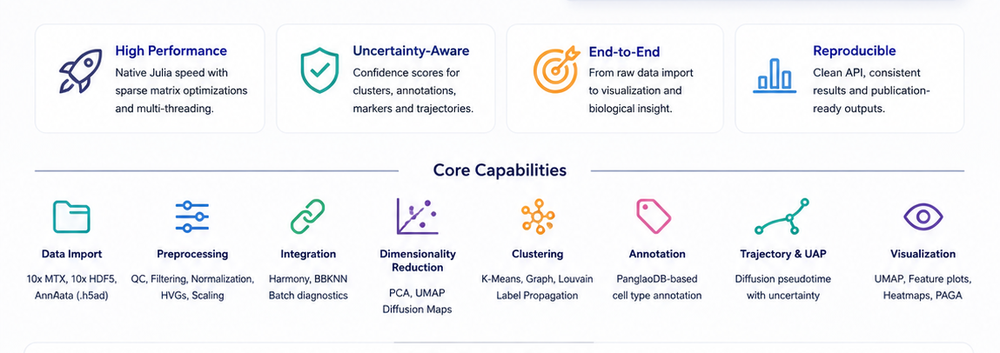
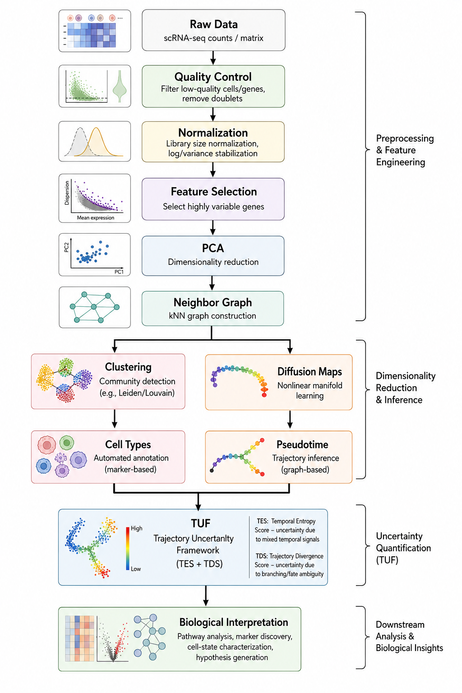

# SiCell.jl


> A high-performance Julia framework for single-cell RNA sequencing analysis and trajectory uncertainty quantification.

**SiCell.jl** is a Julia-native toolkit for end-to-end single-cell transcriptomics analysis. It provides efficient implementations of core scRNA-seq workflows including preprocessing, dimensionality reduction, clustering, differential expression, trajectory analysis, and biological interpretation.

In addition to a complete analysis workflow, SiCell.jl introduces the **Trajectory Uncertainty Framework (TUF)**, a novel methodology that decomposes trajectory uncertainty into two complementary components:

* **Temporal Entropy Score (TES)** — quantifies local temporal inconsistency and cellular state mixing.
* **Trajectory Divergence Score (TDS)** — quantifies directional ambiguity and potential lineage divergence.

Together, TES and TDS provide a new perspective on cellular plasticity, transitional states, and developmental complexity.

---

# Why SiCell.jl?

Single-cell datasets continue to increase dramatically in scale and complexity. SiCell.jl leverages Julia's performance-oriented design to enable fast, memory-efficient, and reproducible analysis of large single-cell datasets.

## Key Features

---

## 🚀 High-Performance Data Processing

* Native support for **10x Genomics**, **AnnData (.h5ad)**, and **10x HDF5 (.h5)** formats.
* Efficient sparse matrix computations.
* Multi-threaded implementations of computationally intensive operations.
* Scalable workflows designed for modern single-cell atlases.

---

## 🔬 Complete Single-Cell Analysis Workflow

### Preprocessing

* Quality control metrics and filtering.
* Library-size normalization.
* Highly variable gene selection.
* Feature scaling.

### Batch Correction and Integration

* Harmony integration.
* BBKNN batch correction.

### Dimensionality Reduction

* Principal Component Analysis (PCA).
* UMAP.
* Diffusion Maps.

### Clustering

* Graph-based Louvain clustering.
* K-means clustering.
* Efficient K-nearest-neighbor graph construction.

---

## 🧬 Cell Identity and Differential Expression

### Cell Type Annotation

* Marker-based annotation using PanglaoDB.
* Jaccard similarity scoring for robust cell identity assignment.

### Differential Expression

* Fast Wilcoxon rank-sum testing.
* Multiple testing correction.
* Automated marker gene discovery.

---

# 🌱 Trajectory Analysis and Trajectory Uncertainty Framework (TUF)

SiCell.jl provides graph-based trajectory inference using diffusion pseudotime and introduces the **Trajectory Uncertainty Framework (TUF)**.

Unlike conventional pseudotime methods that only provide an ordering of cells, TUF quantifies the local uncertainty surrounding each cellular state.

### Temporal Entropy Score (TES)

TES measures how heterogeneous the developmental states are within a cell's local neighborhood.

High TES indicates:

* Temporal mixing.
* Transitional cellular states.
* Increased local heterogeneity.

---

### Trajectory Divergence Score (TDS)

TDS measures disagreement among forward developmental directions.

High TDS indicates:

* Lineage bifurcation.
* Multiple possible developmental directions.
* Increased trajectory ambiguity.

---

TUF is independent of the trajectory inference algorithm and can be applied to pseudotime estimates generated by different methods.

---

# 🎨 Visualization

SiCell.jl includes publication-quality visualization tools:

* UMAP and PCA embeddings.
* Feature expression plots.
* Violin plots.
* Volcano plots.
* Trajectory uncertainty maps.
* TES/TDS visualization.
* PAGA-style trajectory graphs.

---

# Features Overview



*Overview of the SiCell.jl capabilities*

---

# Installation

Install directly from GitHub:

```julia
using Pkg

Pkg.add(url="https://github.com/yourusername/SiCell.jl.git")
```

Load the package:

```julia
using SiCell
```

---

# Quick Start

```julia
using SiCell

# Load data
obj = read_h5ad("dataset.h5ad")

# Preprocessing
calculate_qc_metrics!(obj)
filter_cells!(obj)
normalize_data!(obj)
find_variable_features!(obj)

# Dimensionality reduction
run_pca!(obj)
find_neighbors!(obj)
run_umap!(obj)

# Clustering
run_graph_clustering!(obj)

# Trajectory analysis
run_diffusion_map!(obj)
run_pseudotime!(obj, root_cell, method="graph")

# Compute trajectory uncertainty
trajectory_uncertainty!(obj)

# Visualization
trajectory_uncertainty_plot(obj)
```

---

# Analysis Pipeline




*Overview of the SiCell.jl Analysis Pipeline*
---

# Design Principles

SiCell.jl is built around three central principles:

### ⚡ Performance First

Efficient algorithms optimized for large-scale single-cell datasets.

### 🧬 Biological Insight

Methods designed to reveal meaningful cellular states, transitions, and regulatory programs.

### 🟣 Julia Native

A clean, idiomatic Julia API with minimal overhead and direct access to high-performance scientific computing.

---

# Documentation

Comprehensive tutorials, examples, and API documentation are available in the project documentation.

---

# Citation

If you use SiCell.jl in your research, please cite:

**SiCell.jl: A Julia framework for single-cell analysis and trajectory uncertainty quantification.**

(Manuscript in preparation.)

---

# Related Software

Trajectory Uncertainty Framework (TUF) is also available as a Python package compatible with Scanpy/AnnData workflows.

---

# Contributing

Contributions, bug reports, feature requests, and discussions are welcome. Please open an issue or submit a pull request.

---

# License

SiCell.jl is released under the MIT License.
